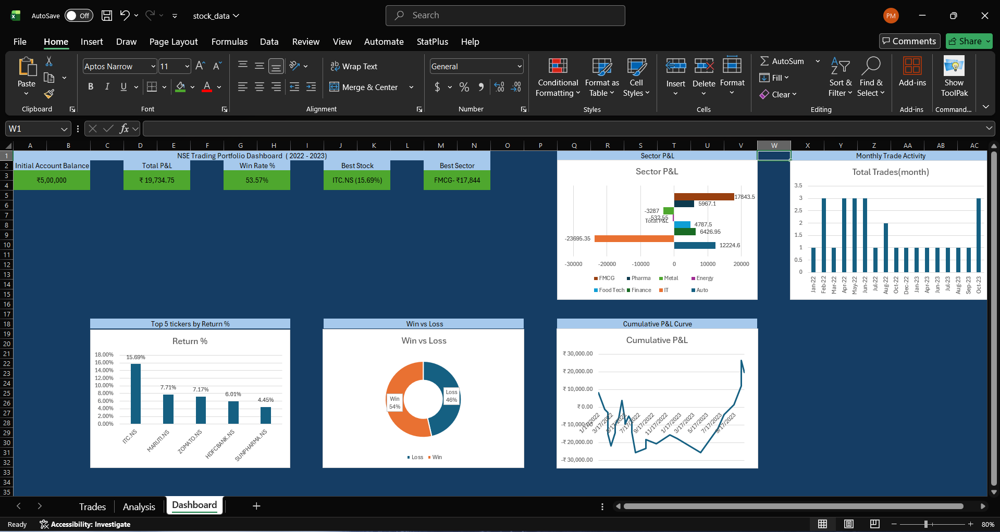
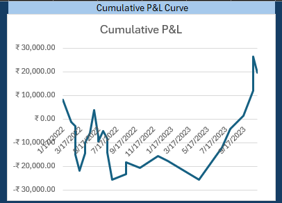
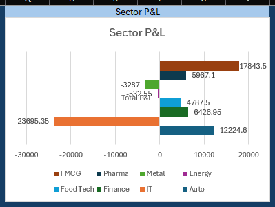
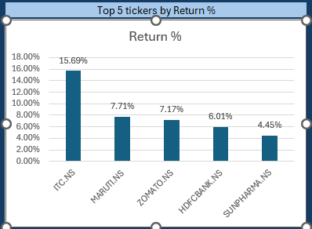

# NSE Stock Portfolio Tracker



---

## Overview

A stock portfolio tracker built in Microsoft Excel, simulating 28 trades across 8 NSE-listed stocks from January 2022 to October 2023. Started with a capital of **₹5,00,000**. Buy and sell prices are pulled from real NSE historical data (Kaggle). The workbook covers P&L analysis, win rate, sector performance, holding periods, and cumulative returns.

Part of my multi-tool data analyst portfolio: Python, SQL, Power BI, Tableau, Excel.

---

## Dataset

**Source:** NSE Stock Market Historical Data by bhaktij on Kaggle  
**Link:** https://www.kaggle.com/datasets/bhaktij/nse-stock-market-historical-data

| Ticker | Company | Sector |
|---|---|---|
| RELIANCE.NS | Reliance Industries | Energy |
| TCS.NS | Tata Consultancy Services | IT |
| HDFCBANK.NS | HDFC Bank | Finance |
| INFY.NS | Infosys | IT |
| SUNPHARMA.NS | Sun Pharma | Pharma |
| TATASTEEL.NS | Tata Steel | Metal |
| MARUTI.NS | Maruti Suzuki | Auto |
| ITC.NS | ITC Limited | FMCG |
| ZOMATO.NS | Zomato Limited | Food Tech |

---

## Workbook Structure

| Sheet | Purpose |
|---|---|
| Trades | 28 raw trade records: buy/sell dates, prices, quantities |
| Analysis | Calculated columns + 8 question summary blocks |
| Dashboard | KPI cards and 5 charts |

---

## Excel Features Used

- Structured Tables with auto-expanding ranges
- Cross-sheet formula references (Analysis pulling from Trades)
- `SUMIF`, `COUNTIF`, `AVERAGEIF` for sector and month aggregations
- `INDEX` / `MATCH` with `MAX` for dynamic winner lookup
- `IF` for Win/Loss classification
- `TEXT` for month label extraction
- Running total formula for cumulative P&L
- Conditional formatting (red/green fill on P&L column)
- Data Validation dropdown for Sector column
- Dynamic charts: line, bar, donut, column (sourced from Analysis summary tables)

---

## Key Findings

- **Total P&L: +₹19,734.75** on a starting capital of ₹5,00,000
- **Win Rate: 53.57%** (15 wins out of 28 trades)
- **FMCG was the best sector** at +₹17,843.50, led by ITC.NS at 15.69% return
- **IT was the worst sector** at -₹23,695.35, with INFY.NS averaging -12.40% across 4 trades
- **Portfolio stayed underwater through most of 2022**, recovering in 2023 on the back of MARUTI (+24.9%), ZOMATO (+106.5%), and SUNPHARMA (+20.5%)
- **ZOMATO had the longest average holding period** at 98.5 days, and delivered both the biggest single-trade loss and the biggest gain
- **Most active months:** Feb-22, Apr-22, May-22, Jun-22, Oct-23, each with 3 trade exits

---

## Visuals

### Cumulative P&L Curve


### Sector P&L Breakdown


### Top 5 Tickers by Return %


---

## File Structure

```
stock-portfolio-tracker/
|-- stock_data.xlsx
|-- README.md
|-- Visuals/
    |-- dashboard_overview.png
    |-- pl_curve.png
    |-- sector_breakdown.png
    |-- top_tickers.png
```

---

**LinkedIn:** www.linkedin.com/in/pushkesh-m  
**GitHub:** https://github.com/pushkesh-m
